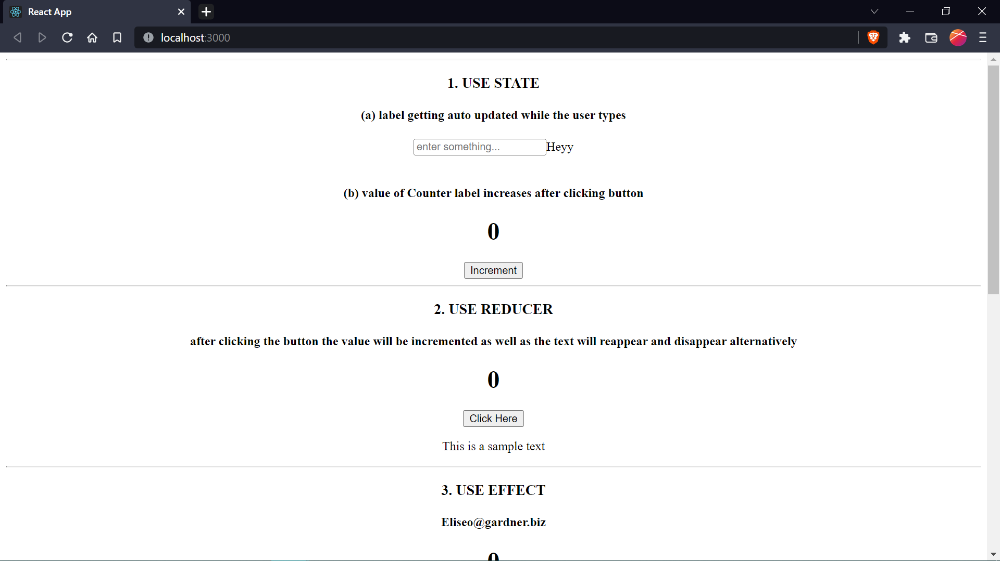

<h1>React Hooks</h1>
<h2>This is a repo containing basic example of all important React Hooks</h2>

|                   |
|:-----------------:|
| **State**         |
| **Reducer**       |
| **Effect**        |
| **Ref**           |
| **Layout Effect** |
| **Imperative**    |
| **Context**       |
| **Memo**          |
| **Callback**      |
  

